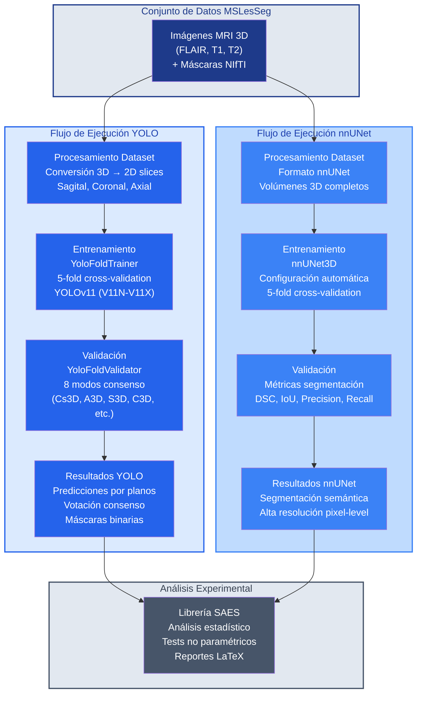

```mermaid
graph TB
    subgraph DS["Conjunto de Datos MSLesSeg"]
        A["Imágenes MRI 3D<br/>(FLAIR, T1, T2)<br/>+ Máscaras NIfTI"]
    end
    
    subgraph YOLO["Flujo de Ejecución YOLO"]
        B["Procesamiento Dataset<br/>Conversión 3D → 2D slices<br/>Sagital, Coronal, Axial"]
        C["Entrenamiento<br/>YoloFoldTrainer<br/>5-fold cross-validation<br/>YOLOv11 (V11N-V11X)"]
        D["Validación<br/>YoloFoldValidator<br/>8 modos consenso<br/>(Cs3D, A3D, S3D, C3D, etc.)"]
        E["Resultados YOLO<br/>Predicciones por planos<br/>Votación consenso<br/>Máscaras binarias"]
    end
    
    subgraph NNUNET["Flujo de Ejecución nnUNet"]
        F["Procesamiento Dataset<br/>Formato nnUNet<br/>Volúmenes 3D completos"]
        G["Entrenamiento<br/>nnUNet3D<br/>Configuración automática<br/>5-fold cross-validation"]
        H["Validación<br/>Métricas segmentación<br/>DSC, IoU, Precision, Recall"]
        I["Resultados nnUNet<br/>Segmentación semántica<br/>Alta resolución pixel-level"]
    end
    
    subgraph INT["Análisis Experimental"]
        K["Librería SAES<br/>Análisis estadístico<br/>Tests no paramétricos<br/>Reportes LaTeX"]
    end
    
    A --> B
    A --> F
    
    B --> C
    C --> D
    D --> E
    
    F --> G
    G --> H
    H --> I
    
    E --> K
    I --> K
    
    style A fill:#1e3a8a,color:#ffffff
    style B fill:#2563eb,color:#ffffff
    style C fill:#2563eb,color:#ffffff
    style D fill:#2563eb,color:#ffffff
    style E fill:#2563eb,color:#ffffff
    style F fill:#3b82f6,color:#ffffff
    style G fill:#3b82f6,color:#ffffff
    style H fill:#3b82f6,color:#ffffff
    style I fill:#3b82f6,color:#ffffff
    style K fill:#475569,color:#ffffff
    
    style DS fill:#e2e8f0,stroke:#1e3a8a,stroke-width:2px,color:#1e3a8a
    style YOLO fill:#dbeafe,stroke:#2563eb,stroke-width:2px,color:#1e40af
    style NNUNET fill:#bfdbfe,stroke:#3b82f6,stroke-width:2px,color:#1e40af
    style INT fill:#e2e8f0,stroke:#475569,stroke-width:2px,color:#374151
```
