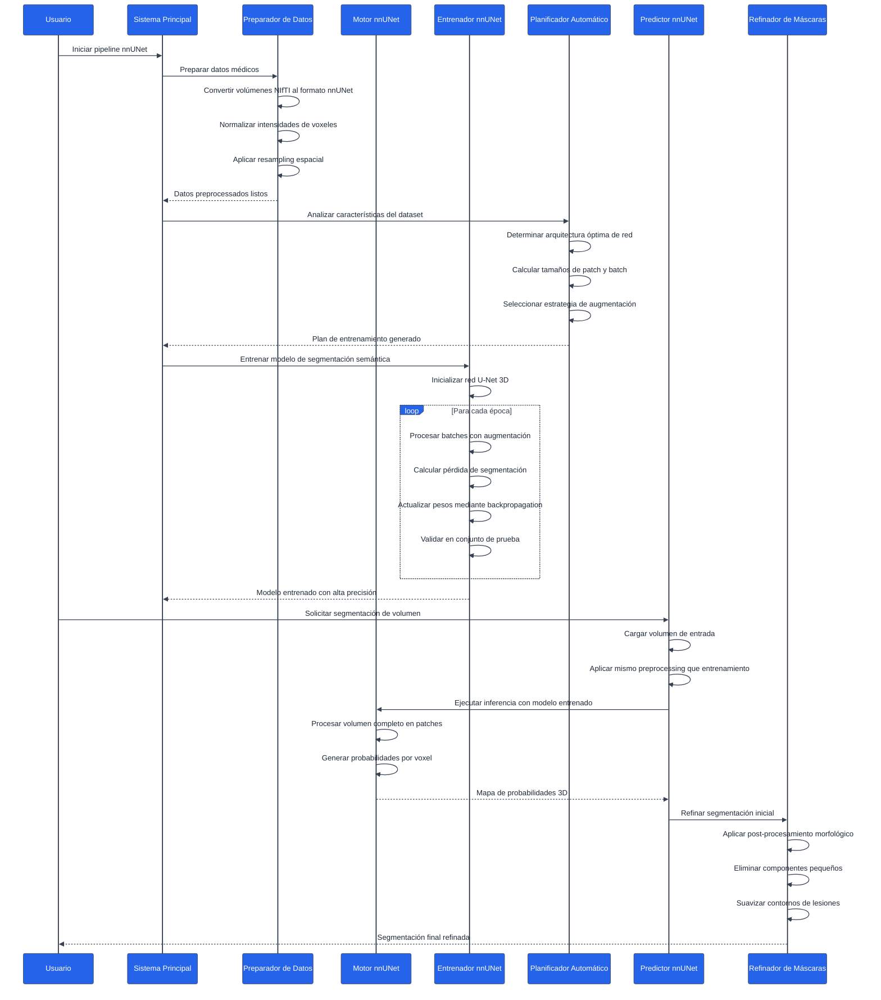

```mermaid
%%{init: {'theme':'base', 'themeVariables': {'primaryColor': '#1f2937', 'primaryTextColor': '#ffffff', 'primaryBorderColor': '#374151', 'lineColor': '#6b7280', 'sectionBkgColor': '#f9fafb', 'actorBorder': '#374151', 'actorBkg': '#2563eb', 'actorTextColor': '#ffffff', 'actorLineColor': '#1f2937', 'signalColor': '#374151', 'signalTextColor': '#1f2937', 'loopTextColor': '#374151', 'noteBackgroundColor': '#e5e7eb', 'noteBorderColor': '#6b7280'}}}%%
sequenceDiagram
    participant Usuario
    participant Sistema as Sistema Principal
    participant Preparador as Preparador de Datos
    participant nnUNet as Motor nnUNet
    participant Entrenador as Entrenador nnUNet
    participant Planificador as Planificador Automático
    participant Predictor as Predictor nnUNet
    participant Refinador as Refinador de Máscaras

    Usuario->>Sistema: Iniciar pipeline nnUNet
    Sistema->>Preparador: Preparar datos médicos
    Preparador->>Preparador: Convertir volúmenes NIfTI al formato nnUNet
    Preparador->>Preparador: Normalizar intensidades de voxeles
    Preparador->>Preparador: Aplicar resampling espacial
    Preparador-->>Sistema: Datos preprocessados listos
    
    Sistema->>Planificador: Analizar características del dataset
    Planificador->>Planificador: Determinar arquitectura óptima de red
    Planificador->>Planificador: Calcular tamaños de patch y batch
    Planificador->>Planificador: Seleccionar estrategia de augmentación
    Planificador-->>Sistema: Plan de entrenamiento generado
    
    Sistema->>Entrenador: Entrenar modelo de segmentación semántica
    Entrenador->>Entrenador: Inicializar red U-Net 3D
    loop Para cada época
        Entrenador->>Entrenador: Procesar batches con augmentación
        Entrenador->>Entrenador: Calcular pérdida de segmentación
        Entrenador->>Entrenador: Actualizar pesos mediante backpropagation
        Entrenador->>Entrenador: Validar en conjunto de prueba
    end
    Entrenador-->>Sistema: Modelo entrenado con alta precisión
    
    Usuario->>Predictor: Solicitar segmentación de volumen
    Predictor->>Predictor: Cargar volumen de entrada
    Predictor->>Predictor: Aplicar mismo preprocessing que entrenamiento
    Predictor->>nnUNet: Ejecutar inferencia con modelo entrenado
    nnUNet->>nnUNet: Procesar volumen completo en patches
    nnUNet->>nnUNet: Generar probabilidades por voxel
    nnUNet-->>Predictor: Mapa de probabilidades 3D
    
    Predictor->>Refinador: Refinar segmentación inicial
    Refinador->>Refinador: Aplicar post-procesamiento morfológico
    Refinador->>Refinador: Eliminar componentes pequeños
    Refinador->>Refinador: Suavizar contornos de lesiones
    Refinador-->>Usuario: Segmentación final refinada
```