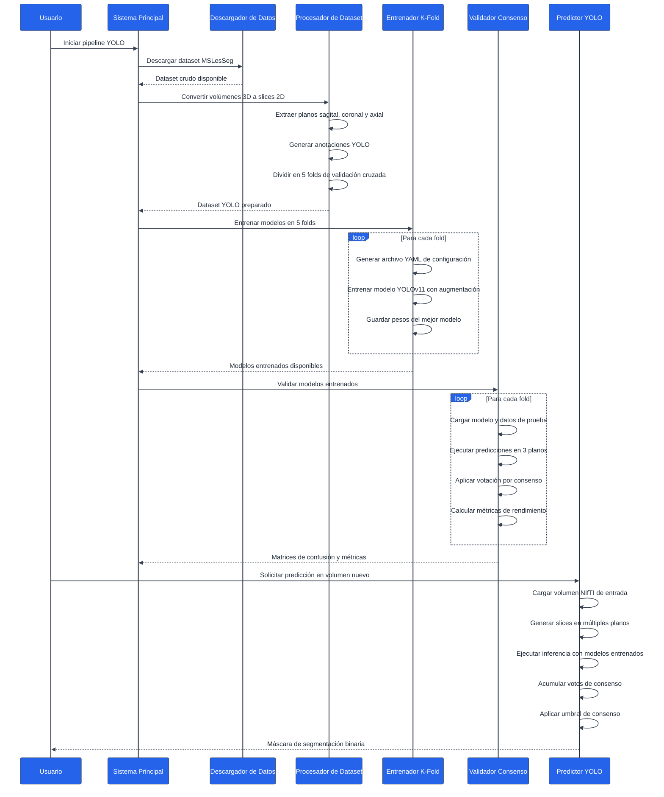

```mermaid
%%{init: {'theme':'base', 'themeVariables': {'primaryColor': '#1f2937', 'primaryTextColor': '#ffffff', 'primaryBorderColor': '#374151', 'lineColor': '#6b7280', 'sectionBkgColor': '#f9fafb', 'actorBorder': '#374151', 'actorBkg': '#2563eb', 'actorTextColor': '#ffffff', 'actorLineColor': '#1f2937', 'signalColor': '#374151', 'signalTextColor': '#1f2937', 'loopTextColor': '#374151', 'noteBackgroundColor': '#e5e7eb', 'noteBorderColor': '#6b7280'}}}%%
sequenceDiagram
    participant Usuario
    participant Sistema as Sistema Principal
    participant Descarga as Descargador de Datos
    participant Procesador as Procesador de Dataset
    participant Entrenador as Entrenador K-Fold
    participant Validador as Validador Consenso
    participant Predictor as Predictor YOLO

    Usuario->>Sistema: Iniciar pipeline YOLO
    Sistema->>Descarga: Descargar dataset MSLesSeg
    Descarga-->>Sistema: Dataset crudo disponible
    
    Sistema->>Procesador: Convertir volúmenes 3D a slices 2D
    Procesador->>Procesador: Extraer planos sagital, coronal y axial
    Procesador->>Procesador: Generar anotaciones YOLO
    Procesador->>Procesador: Dividir en 5 folds de validación cruzada
    Procesador-->>Sistema: Dataset YOLO preparado
    
    Sistema->>Entrenador: Entrenar modelos en 5 folds
    loop Para cada fold
        Entrenador->>Entrenador: Generar archivo YAML de configuración
        Entrenador->>Entrenador: Entrenar modelo YOLOv11 con augmentación
        Entrenador->>Entrenador: Guardar pesos del mejor modelo
    end
    Entrenador-->>Sistema: Modelos entrenados disponibles
    
    Sistema->>Validador: Validar modelos entrenados
    loop Para cada fold
        Validador->>Validador: Cargar modelo y datos de prueba
        Validador->>Validador: Ejecutar predicciones en 3 planos
        Validador->>Validador: Aplicar votación por consenso
        Validador->>Validador: Calcular métricas de rendimiento
    end
    Validador-->>Sistema: Matrices de confusión y métricas
    
    Usuario->>Predictor: Solicitar predicción en volumen nuevo
    Predictor->>Predictor: Cargar volumen NIfTI de entrada
    Predictor->>Predictor: Generar slices en múltiples planos
    Predictor->>Predictor: Ejecutar inferencia con modelos entrenados
    Predictor->>Predictor: Acumular votos de consenso
    Predictor->>Predictor: Aplicar umbral de consenso
    Predictor-->>Usuario: Máscara de segmentación binaria
```